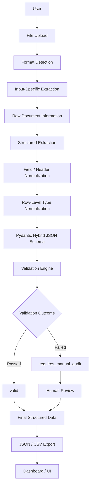
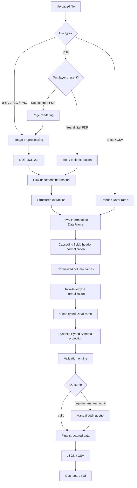
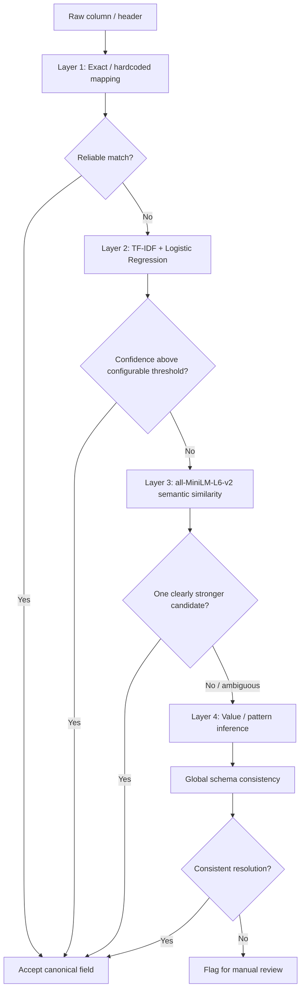
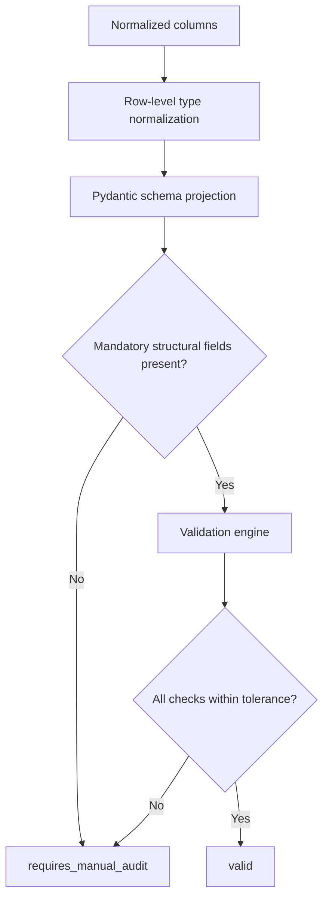
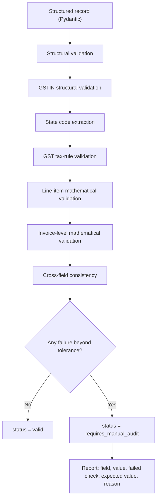

# VYOM+ — End-to-End AI-Powered GST Invoice Intelligence System

> **Hacktober Fest | Open Source AI Hackathon - Organized by Elevate | Qualifier Round Submission** ·
>
> Problem Statement **PS3**
> 
> *Status: technical proposal.

---

## 1. Project Name

**VYOM+: End-to-End AI-Powered GST Invoice Intelligence System**

> VYOM+ is an end-to-end AI-powered GST invoice intelligence system that converts heterogeneous and potentially noisy invoices (handwritten, scanned, digital, tabular and image-based) into standardized, validated financial records.

**Core philosophy**

```text
READ → UNDERSTAND → EXTRACT → NORMALIZE → VALIDATE → VERIFY → EXPORT
```

VYOM+ is **not an OCR demo**. It transforms heterogeneous invoice documents into standardized and independently validated financial records. Text extraction is only the first stage of a complete document-intelligence pipeline.

---

## 2. Problem Statement

**PS3: End-to-End AI-Powered GST Invoice Intelligence System**

Businesses receive GST invoices in many forms: Excel sheets, CSV exports, digital PDFs, scanned PDFs, phone photographs and handwritten bills. Layouts, column names, languages of presentation, date and currency formats, and the quality of the input all vary from one supplier to the next. Manual re-entry into accounting systems is slow and error-prone, and a single wrong digit in a GSTIN, a tax amount or a total can cause reconciliation problems.

The system must accept **Excel, CSV, PDF, JPEG, JPG and PNG** inputs and:

1. Identify the input type.
2. Route the file through the appropriate processing pipeline.
3. Clean structured Excel/CSV data.
4. Extract information from PDF and image documents.
5. Distinguish digital (text-layer) PDFs from scanned PDFs.
6. Extract invoice, GST, tax, financial and line-item information.
7. Handle inconsistencies and uncertainty.
8. Output structured JSON and/or structured tables.
9. Provide a simple upload and review interface.

Special emphasis is placed on **handwritten, scanned, printed and digital GST invoices with heterogeneous layouts**.

**Why a pipeline, not just OCR?** Even perfect text recognition leaves four open problems: *what does each column mean* (header variability), *what is the clean value inside each cell* (dirty values), *does the record fit a consistent schema* (missing and extra fields), and *is the financial content actually correct* (GST and arithmetic validity). VYOM+ addresses all four.

---

## 3. Project Overview

VYOM+ is a modular pipeline with seven conceptual phases:

| Phase | Purpose | Main components (proposed) |
|---|---|---|
| **Read** | Accept and identify the input | File upload, format detector |
| **Understand** | Choose the right processing route; understand visual layout | Input router, image preprocessing, **GOT-OCR 2.0** |
| **Extract** | Capture what the document contains | Raw extraction into an intermediate DataFrame |
| **Normalize** | Standardize field names and cell values | Cascading header normalization, row-level type normalization |
| **Validate** | Check structure, GST rules and arithmetic | Pydantic hybrid schema, validation engine |
| **Verify** | Route suspicious records to a human | `requires_manual_audit` review queue |
| **Export** | Deliver standardized output | JSON / CSV, dashboard |

### Five technical differentiators

| # | Differentiator | How it is achieved |
|---|---|---|
| 1 | **Visual robustness** | Image preprocessing + GOT-OCR 2.0 document AI |
| 2 | **Semantic robustness** | Cascading header normalization: exact mapping → TF-IDF + Logistic Regression → MiniLM semantic similarity → value/pattern inference → global schema consistency |
| 3 | **Data robustness** | Row-level type normalization: currency cleaning, numeric casting, date standardization |
| 4 | **Schema robustness** | Pydantic **Hybrid JSON Schema**: mandatory core + optional conditional fields + dynamic overflow metadata |
| 5 | **Financial robustness** | Deterministic validation: GSTIN structure, state codes, GST tax rules, line-item and invoice-level arithmetic, manual audit |

These five layers form one coherent architecture, not five independent features.

---

## 4. Proposed Solution

### 4.1 Core design principle

> **VLM/OCR extracts what it sees; deterministic Python processing decides how the information is mapped, standardized, validated and exported.**

Raw OCR/VLM output is **never forced directly** into the final rigid schema. VYOM+ uses a **two-stage extraction architecture**.

**Stage 1: Raw Extraction**

```text
VLM / OCR / Parser
        ↓
Raw Document Information
        ↓
Raw Table / Intermediate DataFrame
```

**Stage 2: Structured Projection**

```text
Raw DataFrame
     ↓
Cascading Field Normalization
     ↓
Row-Level Type Normalization
     ↓
Pydantic Schema Projection
     ↓
Hybrid JSON Schema
     ↓
Validation
     ↓
Final Structured Output
```

This separation:

- prevents a missing field from immediately causing a schema exception;
- prevents unexpected fields from being discarded;
- allows noisy OCR output to be normalized before it is judged;
- makes the document-AI layer replaceable;
- separates visual extraction from deterministic validation;
- improves robustness to heterogeneous invoice layouts.

### 4.2 End-to-end pipeline

```text
USER
  ↓
FILE UPLOAD
  ↓
FORMAT DETECTION
  ↓
INPUT-SPECIFIC EXTRACTION
  ↓
RAW DOCUMENT INFORMATION
  ↓
STRUCTURED EXTRACTION
  ↓
FIELD / HEADER NORMALIZATION
  ↓
ROW-LEVEL TYPE NORMALIZATION
  ↓
PYDANTIC HYBRID JSON SCHEMA
  ↓
VALIDATION ENGINE
  ↓
VALID / REQUIRES MANUAL AUDIT
  ↓
FINAL STRUCTURED DATA
  ↓
JSON / CSV
  ↓
DASHBOARD / UI
```

### 4.3 Input-specific processing routes

| Input | Route |
|---|---|
| **Excel / CSV** | Pandas DataFrame → header/field normalization → row-level type normalization → Pydantic hybrid schema → validation → output. *Treated as a data-cleaning problem, not an OCR problem.* |
| **Digital / text PDF** | Text-layer detection → text/table extraction → structured extraction → normalization → validation |
| **Scanned PDF** | Page rendering → image preprocessing → GOT-OCR 2.0 → raw document information → structured extraction → normalization → validation |
| **JPG / JPEG / PNG** | Image preprocessing → GOT-OCR 2.0 → raw document information → structured extraction → normalization → validation |

### 4.4 Principle: extraction is not acceptance

Extracted values are treated as *claims*, not facts. Every record passes through a deterministic validation engine, and any record that fails is routed to `requires_manual_audit` instead of being silently accepted.

---

## 5. Objectives

1. Build a single pipeline that accepts Excel, CSV, PDF, JPEG, JPG and PNG invoices.
2. Automatically detect the input type and route it, including telling digital PDFs apart from scanned PDFs.
3. Use an open-source document-AI model (GOT-OCR 2.0) to read scanned, printed and difficult invoice images, with handwriting handled where feasible.
4. Separate raw extraction from structured projection to keep the system robust to layout variation.
5. Resolve inconsistent column names through a cascading, explainable normalization workflow.
6. Convert dirty cell values (currency strings, mixed date formats) into clean machine-readable values.
7. Project every record onto a hybrid schema that enforces a strict core, tolerates optional fields and preserves unexpected fields.
8. Validate GSTIN structure, state codes, GST tax rules, line-item arithmetic and invoice-level totals.
9. Route suspicious records to human review with clear, field-level reasons.
10. Export standardized JSON and CSV through a simple upload and review interface.
11. Keep the document-AI layer modular so other open-source models can be benchmarked later.

---

## 6. Target Users / Use Case

| User | Use case |
|---|---|
| **Small and medium businesses** | Digitize purchase and sales invoices that arrive as photos, PDFs or spreadsheets |
| **Accountants / CA firms** | Reduce manual data entry and obtain pre-checked records for GST filing workflows |
| **Finance and accounts-payable teams** | Standardize vendor invoices that come in many layouts, and surface mismatches before payment |
| **Auditors and compliance reviewers** | Receive a short, explained list of records that need attention instead of re-checking everything |
| **Developers of accounting tools** | Use the standardized JSON as an integration layer |

**Typical scenario.** A trader uploads a mix of a phone photo of a handwritten bill, a scanned supplier PDF, and a vendor's Excel statement. VYOM+ identifies each format, extracts and normalizes the content, validates the GST and arithmetic, and returns a standardized table in which clean records are marked `valid` and doubtful ones are marked `requires_manual_audit` with reasons.

---

## 7. Open-Source AI Technology Selected

VYOM+ uses two open-source AI components, each with a distinct, non-overlapping role, plus a lightweight classical ML component.

| Component | Type | Role in VYOM+ |
|---|---|---|
| **GOT-OCR 2.0** | Open-source visual / document-AI model | Reads scanned PDFs and invoice images and produces raw document information |
| **sentence-transformers/all-MiniLM-L6-v2** | Open-source **embedding / semantic-similarity model** | Layer 3 of header normalization: maps unfamiliar column names to canonical fields |

### 7.1 GOT-OCR 2.0

GOT-OCR 2.0 is used as an open-source visual/document AI component rather than a plain OCR library. In VYOM+ it is intended to support:

- document text extraction;
- visual document understanding and layout awareness;
- scanned and printed invoices;
- difficult or low-quality invoice images;
- handwritten invoice processing where feasible.

```text
Image / Scanned PDF
       ↓
Image Preprocessing
       ↓
GOT-OCR 2.0
       ↓
Raw Document Information
       ↓
Structured Extraction
```

| | |
|---|---|
| **Input** | Preprocessed invoice image or rendered PDF page |
| **Output** | Raw document information (text, and table-like structure where recoverable), loaded into an intermediate DataFrame |

### 7.2 sentence-transformers/all-MiniLM-L6-v2

This model is a **sentence-embedding / semantic-similarity model**. It is **not** a generative LLM or SLM, **not** an OCR model and **not** a GST validation engine. It does not check GST rules, tax arithmetic or invoice totals.

```text
"Bill Ref"
    ↓
Embedding
    ↓
Compare with canonical field descriptions
    ↓
Cosine Similarity
    ↓
invoice_number
```

| | |
|---|---|
| **Input** | An unknown column header and the embeddings of canonical field descriptions |
| **Output** | Candidate canonical fields with cosine-similarity scores |

---

## 8. Why This Technology Was Selected

The choices are driven by the problem, not by popularity.

**Why a document-AI model (GOT-OCR 2.0)?**
Invoices are visual documents. Photographs, stamps, skewed scans, tables and handwriting defeat simple text-layer extraction. A document-AI model is better matched to this than rule-based parsing. It is also open-weight, so it can run locally and be inspected, and it keeps sensitive financial documents on infrastructure the team controls.

**Why an embedding model (all-MiniLM-L6-v2)?**
Supplier headers are unpredictable: "Bill Ref", "Inv. Reference", "Voucher No". An exact-match dictionary cannot cover them all, and a generative LLM would be heavier, slower and non-deterministic for what is a *matching* problem. A small embedding model is lightweight and runs on CPU. It also yields a similarity score that can be thresholded and explained.

**Why TF-IDF + Logistic Regression before the embedding model?**
It is cheap, local and fast, and it resolves common header variants without invoking a neural model at all. The embedding model is only used when the cheaper layer is not confident.

**Why deterministic validation instead of AI judging correctness?**
GST rules and arithmetic are exactly checkable. Using code for these checks makes results reproducible and auditable, so AI is used where perception and semantics are needed and rules are used where correctness can be computed.

**Why open source overall?**

- *Transparency:* components can be inspected and their limitations understood.
- *Local deployment:* invoices contain sensitive financial data and need not leave the user's environment.
- *Modularity:* any open-source document model can be swapped in and benchmarked.
- *Cost:* no per-document API fees, which suits small businesses.
- *Hackathon feasibility:* all components are available as downloadable weights or libraries.

**Rejected alternative.** A thin wrapper that sends an image to a hosted model and prints the reply would be a generic wrapper, which the hackathon explicitly discourages. VYOM+ treats AI as one component inside an engineered system.

---

## 9. AI's Role in the System

AI is used where the problem is perceptual or semantic. Deterministic code is used where the problem is exact.

| Stage | Technique | AI? |
|---|---|---|
| Reading scanned/image invoices | GOT-OCR 2.0 | **Yes** (visual / document AI) |
| Header classification (common variants) | TF-IDF + Logistic Regression | **Yes** (classical ML) |
| Header classification (unseen variants) | all-MiniLM-L6-v2 embeddings + cosine similarity | **Yes** (embedding / semantic AI) |
| Value/pattern inference | Pattern rules (GSTIN-like, dates, percentages, money) | Rule-based |
| Global schema consistency | Constraint reasoning over candidate mappings | Rule-based |
| Row-level type normalization | Currency cleaning, numeric casting, date parsing | Rule-based |
| Schema enforcement | **Pydantic** | **Not AI** |
| GST and arithmetic validation | Regex, state-code logic, `Decimal` arithmetic | **Not AI** |
| Final accept / audit decision | Validation outcome | **Not AI** |

Pydantic is used for schema enforcement, validation, type handling, optional fields, serialization, controlled defaults/nulls, schema projection and preservation of additional metadata. It is **not** an AI component.

The result is that perception and semantics are handled by open-source AI, while financial correctness is handled by transparent, testable rules.

---

## 10. System Architecture

### 10.1 High-level system architecture



### 10.2 Layered view

```text
┌──────────────────────────────────────────────────────────────┐
│ PRESENTATION   React UI: upload · results · manual review    │
├──────────────────────────────────────────────────────────────┤
│ API            FastAPI: upload, status, results, export      │
├──────────────────────────────────────────────────────────────┤
│ INGESTION      File detector · CSV/Excel/PDF parsers         │
├──────────────────────────────────────────────────────────────┤
│ DOCUMENT AI    Image preprocessing · GOT-OCR 2.0             │
├──────────────────────────────────────────────────────────────┤
│ EXTRACTION     Raw DataFrame · structured field extraction   │
├──────────────────────────────────────────────────────────────┤
│ NORMALIZATION  Cascading header mapping · row-level typing   │
├──────────────────────────────────────────────────────────────┤
│ SCHEMA         Pydantic Hybrid JSON Schema                   │
├──────────────────────────────────────────────────────────────┤
│ VALIDATION     GSTIN · state code · GST rules · arithmetic   │
├──────────────────────────────────────────────────────────────┤
│ OUTPUT         JSON · CSV · valid / requires_manual_audit    │
└──────────────────────────────────────────────────────────────┘
```

### 10.3 Modularity

The normalization, schema and validation layers are independent of the document-AI layer. Changing the OCR/VLM model changes only the extraction layer, so the rest of the system is unaffected.

---

## 11. Component-Level Architecture

```mermaid
flowchart LR
    subgraph ING["Ingestion"]
        A1["file_detector"]
        A2["csv_parser / excel_parser"]
        A3["pdf_parser"]
    end
    subgraph DOC["Document AI"]
        B1["image_preprocessor"]
        B2["GOT-OCR 2.0"]
    end
    subgraph EXT["Extraction"]
        C1["Raw DataFrame"]
        C2["field_extractor"]
    end
    subgraph NORM["Normalization"]
        D1["Cascading header normalizer"]
        D2["Row-level type normalizer"]
    end
    subgraph SCH["Schema"]
        E1["Pydantic Hybrid Schema"]
    end
    subgraph VAL["Validation"]
        F1["gst_validator"]
        F2["arithmetic_validator"]
        F3["consistency_validator"]
    end
    subgraph OUT["Output"]
        G1["JSON / CSV export"]
        G2["Dashboard / manual review"]
    end

    A1 --> A2
    A1 --> A3
    A1 --> B1
    A3 -->|Scanned PDF pages| B1
    B1 --> B2
    B2 --> C1
    A2 --> C1
    A3 -->|Digital PDF text/tables| C1
    C1 --> C2
    C2 --> D1
    D1 --> D2
    D2 --> E1
    E1 --> F1
    F1 --> F2
    F2 --> F3
    F3 --> G1
    F3 --> G2
```



| Component | Responsibility | Technology |
|---|---|---|
| **File detector** | Identify type by extension and content; for PDFs, detect whether a text layer exists | Python |
| **CSV / Excel parsers** | Load tabular files into DataFrames | Pandas |
| **PDF parser** | Text/table extraction from digital PDFs; page rendering for scanned PDFs | Python PDF libraries |
| **Image preprocessor** | Resolution check, grayscale, denoising, contrast enhancement, deskewing, perspective correction | OpenCV, Pillow |
| **GOT-OCR 2.0 module** | Visual/document extraction from images and scanned pages | GOT-OCR 2.0 |
| **Field extractor** | Convert raw information into an intermediate table of candidate fields | Python, Pandas |
| **Header normalizer** | Four-layer cascading mapping plus global schema consistency | scikit-learn, sentence-transformers |
| **Row-level type normalizer** | Currency cleaning, numeric casting, date standardization | Python, Pandas |
| **Pydantic schema** | Hybrid schema projection and serialization | Pydantic |
| **Validators** | GSTIN, state-code, GST-rule, arithmetic and cross-field checks | Python (`Decimal`) |
| **Exporter** | JSON and CSV output | Python |
| **UI** | Upload, results view, manual review | React, HTML, CSS, JavaScript |

---

## 12. Data / Information Flow



### 12.1 Column normalization vs. row-level type normalization

These are two different questions, and VYOM+ asks both in order:

| Step | Question | Example |
|---|---|---|
| **Column normalization** | *What does this column mean?* | `Bill Ref` → `invoice_number` |
| **Row-level type normalization** | *What is the clean machine-readable value inside this field?* | `₹ 1,250.00` → `1250.0` |

```text
COLUMN NORMALIZATION → ROW-LEVEL TYPE NORMALIZATION → MATHEMATICAL VALIDATION
```

Mathematical validation runs only **after** row-level normalization, because arithmetic over strings such as `"₹1,250"` is meaningless.

### 12.2 Row-level type normalization rules

**Currency cleaning.** Applies to `unit_price`, `taxable_value`, `cgst_amount`, `sgst_amount`, `igst_amount`, `grand_total`, `discount`, `freight_charges`, `cess_amount`. Currency symbols, thousands separators, stray spaces and formatting characters are removed: `₹ 1,250.00` → `1250.00` → `1250.0`.

**Numeric casting.** `quantity`, `unit_price`, `taxable_value`, GST rate, tax amounts and totals are cast to numeric types.
Missing values are **not blindly converted to `0.0`**. The system distinguishes:

- genuinely zero,
- not applicable,
- not present,
- unknown,
- expected but not extracted.

**Date standardization.** `12/04/2026`, `12-Apr-26`, `12 April 2026` and `2026-04-12` → `2026-04-12` (ISO format). Ambiguous or invalid dates are **flagged**, not silently misinterpreted.

### 12.3 Worked example (illustrative)

**Raw extraction**

| Bill Ref | Qty | Rate | Tax | Invoice Date |
|---|---:|---:|---:|---|
| INV-104 | 2 | ₹1,250 | 18% | 12-Apr-26 |

**After column normalization**

| invoice_number | quantity | unit_price | gst_rate | invoice_date |
|---|---:|---:|---:|---|
| INV-104 | 2 | ₹1,250 | 18% | 12-Apr-26 |

**After row-level type normalization**

| invoice_number | quantity | unit_price | gst_rate | invoice_date |
|---|---:|---:|---:|---|
| INV-104 | 2.0 | 1250.0 | 18.0 | 2026-04-12 |

The record then proceeds to the Pydantic Hybrid Schema and the validation engine.

---

## 13. Agentic Workflow

VYOM+ deliberately does **not** use a multi-agent framework or artificial "agents" for each layer. Its agentic behavior is a **Cascading Intelligent Decision Workflow**: the system observes a piece of evidence, evaluates how reliable the current interpretation is, and escalates to a stronger method only when needed.

```text
OBSERVE → CLASSIFY → EVALUATE → ESCALATE → INFER → VERIFY → DECIDE
```

The workflow operates at two levels.

### 13.1 Level 1: Column-level intelligent escalation

```text
Exact mapping → ML classifier → semantic similarity → value inference → schema consistency
```



**Layer 1: Exact / hardcoded mapping.** Known variants map directly: `invoice no`, `invoice number`, `inv #`, `bill no` → `invoice_number`. `GST no`, `GSTIN`, `GST number` → the appropriate GSTIN field **based on context** (supplier or recipient).

**Layer 2: TF-IDF + Logistic Regression.** A lightweight local classifier (e.g., `Bill Ref` → TF-IDF → Logistic Regression → `invoice_number`). A starting confidence threshold of roughly 85% may be used as a **configurable parameter**. It is a design setting and **not a measured accuracy**. If confidence is insufficient, the header escalates to Layer 3.

**Layer 3: Semantic similarity.** The unknown header is embedded with `sentence-transformers/all-MiniLM-L6-v2` and compared with embeddings of canonical field descriptions. If one candidate is clearly stronger, it is accepted. If several candidates are similarly plausible, the system **does not blindly pick one** and escalates to Layer 4.

**Layer 4: Value / pattern inference.** When a header is random, missing, meaningless or badly OCR'd, the system inspects the actual values:

| Value pattern | Candidate meaning |
|---|---|
| GSTIN-like, e.g. `22ABCDE1234F1Z5` | GSTIN field |
| Date-like | Date field |
| Percentage-like | Tax / GST rate |
| Money-like | Financial amount |
| Invoice-number-like pattern | `invoice_number` |

**Global schema consistency.** Columns are not mapped in isolation. The pipeline is:

```text
Column → Candidate Meaning → Confidence / Evidence → Global Schema Consistency → Canonical Field
```

The whole schema is considered before ambiguous mappings are finalized (for example, two columns should not both claim to be `invoice_number`, and a record that already has a supplier GSTIN column informs which column is the recipient's).

### 13.2 Level 2: Data-quality decision pipeline

```text
Normalized columns → row-level type normalization → schema projection → validation → valid / manual audit
```



Confidence and similarity thresholds exist only as parameters inside these cascading decisions. VYOM+ does **not** introduce a separate "Confidence Engine".

---

## 14. Technology Stack

| Layer | Technology | Justification |
|---|---|---|
| Frontend | React, HTML, CSS, JavaScript | Simple upload, results and review interface |
| Backend / API | Python, FastAPI | Async file upload, clean API for the pipeline |
| Data processing | Pandas, NumPy | DataFrame-based raw and normalized tables |
| Classical ML | scikit-learn (TF-IDF, Logistic Regression) | Lightweight local header classifier |
| Semantic AI | `sentence-transformers/all-MiniLM-L6-v2` | Embedding-based header similarity |
| Document AI | GOT-OCR 2.0 | Visual/document extraction from images and scanned PDFs |
| Image processing | OpenCV, Pillow | Preprocessing for noisy images |
| PDF processing | Appropriate Python PDF/document parsing libraries | Text-layer detection, text/table extraction, page rendering |
| Schema / validation | Pydantic | Hybrid schema, type handling, serialization |
| Financial arithmetic | Python `Decimal` | Exact arithmetic with explicit rounding |
| Output | JSON, CSV | Standardized interchange formats |

No additional frameworks are proposed. In particular, no LangChain, CrewAI or AutoGen is used, because the workflow is a deterministic cascade and does not need an agent-orchestration framework.

---

## 15. Expected Features

- Multi-format upload: Excel, CSV, PDF, JPEG, JPG, PNG.
- Automatic input-type detection and routing, including digital vs. scanned PDF detection.
- Image preprocessing for poor scans, skew and low contrast.
- GOT-OCR 2.0 extraction for scanned, printed and difficult invoices; handwriting handled where feasible.
- Two-stage extraction: raw intermediate table, then structured projection.
- Four-layer cascading header normalization with global schema consistency.
- Row-level type normalization (currency, numeric, date).
- Pydantic Hybrid JSON Schema with mandatory, optional and dynamic fields.
- Preservation of unexpected fields in `additional_metadata` / `extra_charges`.
- GSTIN structural validation and state-code extraction.
- Configurable GST tax-rule checks (CGST/SGST vs. IGST).
- Line-item and invoice-level arithmetic validation with explicit tolerance.
- `valid` / `requires_manual_audit` status per record.
- Manual-review view showing the problematic field, extracted value, failed check, expected value and reason.
- JSON and CSV export.
- Simple dashboard for upload, results and audit.

### 15.1 Canonical invoice schema (conceptual)

| Group | Fields |
|---|---|
| **Document** | `document_type`, `document_number`, `document_date` |
| **Supplier** | `supplier_name` / `legal_name`, `supplier_gstin`, `supplier_address` |
| **Recipient** | `recipient_name`, `recipient_gstin`, `recipient_address` |
| **Invoice** | `invoice_number`, `invoice_date`, `due_date` |
| **Items** | `description`, `hsn_code` (HSN/SAC), `quantity`, `unit_price`, `discount`, `taxable_value` (assessable), `gst_rate` |
| **Taxes** | `cgst_amount`, `sgst_amount`, `igst_amount`, `cess_amount` (where applicable) |
| **Totals** | `total_taxable_value` (subtotal), `total_tax`, `grand_total` |

Not every invoice contains every field.

### 15.2 Pydantic Hybrid JSON Schema

```text
Raw DataFrame → Normalized DataFrame → Pydantic Model → Hybrid JSON → Validation
```

The schema is **hybrid**: a strict standardized core, optional conditional fields, and a dynamic extension dictionary.

**Category 1: Mandatory core fields**

| Group | Fields |
|---|---|
| Invoice metadata | `document_number`, `document_date`, `supplier_legal_name`, `supplier_gstin`, `recipient_gstin`, `total_invoice_value` |
| Line-item fields | `item_description`, `hsn_code`, `quantity`, `unit_price`, `assessable/taxable_value`, `gst_rate`, `igst_amount`, `cgst_amount`, `sgst_amount` |

If a mandatory structural field is missing, VYOM+ **does not invent it**. It flags the record and routes it to `requires_manual_audit`. These are *project-level structural requirements*, not a claim of complete legal GST compliance.

**Category 2: Conditionally mandatory / optional fields**
Examples: `cess_amount`, `shipping_address`, `e_way_bill_number`, `discount`, `freight_charges`. They are typed as `Optional[float]` or `Optional[str]`. If genuinely absent, no exception is raised. The system still distinguishes *not applicable / not present* from *expected but not extracted*, and does not turn every missing value into zero.

**Category 3: Dynamic overflow / catch-all dictionary**
Invoices can carry unpredictable fields such as Packaging Fees, TCS %, Vehicle No, Handling Charges or custom references. These are **not discarded**. They are preserved in `additional_metadata` and/or `extra_charges`.

This design improves:

- **Robustness:** a missing optional field or an unexpected column does not crash the pipeline.
- **Scalability:** new supplier-specific fields need no schema change.
- **Information preservation:** nothing present in the source is silently dropped.

### 15.3 Validation engine

```text
STRUCTURED EXTRACTION
        ↓
STRUCTURAL VALIDATION
        ↓
GSTIN VALIDATION
        ↓
STATE CODE EXTRACTION
        ↓
GST TAX-RULE VALIDATION
        ↓
LINE-ITEM MATHEMATICAL VALIDATION
        ↓
INVOICE-LEVEL MATHEMATICAL VALIDATION
        ↓
CROSS-FIELD CONSISTENCY
        ↓
VALID / REQUIRES MANUAL AUDIT
```



**GSTIN structural validation**

```text
^[0-9]{2}[A-Z]{5}[0-9]{4}[A-Z]{1}[1-9A-Z]{1}Z[0-9A-Z]{1}$
```

Common OCR confusions (`O` vs `0`, `I` vs `1`, `S` vs `5`) are considered when diagnosing failures. The regex checks **structure only**; it does not prove complete legal GSTIN validity.

**State-code extraction**

```python
seller_state_code = seller_gstin[:2]
buyer_state_code = buyer_gstin[:2]
```

**GST tax rules** (configurable project rules; real-world exceptions exist and are routed to review rather than assumed wrong or right):

| Case | Expected | Potential anomaly |
|---|---|---|
| Same state | CGST + SGST, with CGST ≈ SGST | IGST > 0 |
| Different state | IGST | CGST > 0 or SGST > 0 |

**Line-item mathematics** (using Python `Decimal`, with explicit rounding and tolerance rules):

```text
Calculated Item Taxable = (quantity × unit_price) − discount
Tax = item_taxable_value × (gst_rate / 100)   compared with   CGST + SGST + IGST
```

**Subtotal**

```text
Calculated Total Taxable = sum(verified item taxable values)   vs.   extracted total taxable value
```

**Grand total**

```text
Calculated Grand Total = total_taxable_value + total_cgst + total_sgst + total_igst + freight_charges
```

If the mismatch against the extracted grand total exceeds the configured tolerance, `status = requires_manual_audit`.

### 15.4 Human review

Suspicious records are routed to `requires_manual_audit`. The review view is intended to show:

- the problematic field,
- the extracted value,
- the failed validation,
- the expected or derived value (where applicable),
- the reason for review.

Suspicious financial information is never silently accepted.

---

## 16. Implementation Approach

Everything in this section is **planned**. No part is claimed as completed.

### 16.1 Planned build order

| Step | Work item |
|---|---|
| 1 | Image preprocessing → GOT-OCR 2.0 → raw information |
| 2 | Raw information → structured extraction |
| 3 | Structured output → validation and reporting |
| 4 | Full image pipeline end to end |
| 5 | Digital / scanned PDF branching |
| 6 | CSV / XLSX handling + cascading header normalization |
| 7 | Row-level type normalization + Pydantic Hybrid Schema |
| 8 | Human review (manual audit) |
| 9 | UI / dashboard |
| 10 | Evaluation and optimization |

The order puts the riskiest component (document AI on difficult images) first and the most deterministic components (validation, schema) next, so the core pipeline works before the interface is polished. If time is short, the CSV/Excel route, normalization, schema and validation still form a complete demonstrable pipeline.

### 16.2 Image preprocessing plan

Resolution check → grayscale → denoising → contrast enhancement → deskewing → perspective correction → GOT-OCR 2.0.

### 16.3 Header classifier plan

- Define canonical field names and short canonical descriptions.
- Build a labeled header-variant list (hand-curated, covering common invoice vocabulary) for TF-IDF + Logistic Regression.
- Precompute canonical-description embeddings with all-MiniLM-L6-v2.
- Keep thresholds (e.g., the starting ~85% classifier confidence) in a configuration file.

### 16.4 Proposed project structure

> *This is a proposed structure. These files do not yet exist.*

```text
VYOM-GST/
├── frontend/
├── backend/
│   ├── main.py
│   ├── ingestion/
│   │   ├── file_detector.py
│   │   ├── csv_parser.py
│   │   ├── excel_parser.py
│   │   └── pdf_parser.py
│   ├── preprocessing/
│   │   └── image_preprocessor.py
│   ├── extraction/
│   │   ├── ocr.py
│   │   ├── document_understanding.py
│   │   └── field_extractor.py
│   ├── schema/
│   │   └── invoice_schema.py
│   ├── normalization/
│   │   └── normalizer.py
│   ├── validation/
│   │   ├── gst_validator.py
│   │   ├── arithmetic_validator.py
│   │   └── consistency_validator.py
│   └── output/
│       ├── json_export.py
│       └── csv_export.py
├── models/
│   ├── header_classifier/
│   └── document_model/
├── evaluation/
├── README.md
└── requirements.txt
```

## 17. Expected Final Output

The final hackathon deliverable is intended to be a working system that accepts the supported formats and returns standardized, validated invoice records via an upload interface.

**Expected outputs**

- standardized JSON;
- structured tabular output (CSV);
- normalized invoice fields;
- line-item records;
- GST and tax information;
- validation status and validation errors (where applicable);
- `additional_metadata` for unexpected fields;
- manual-review status for suspicious records.

**Possible statuses**

```text
valid
requires_manual_audit
```

### Illustrative / Proposed Output

> *The JSON below is an illustrative example of the proposed output format. It is **not** an actual implementation result. Values marked `...` are placeholders.*

```json
{
  "document_number": "INV-104",
  "document_date": "2026-04-12",
  "supplier": {
    "legal_name": "...",
    "gstin": "..."
  },
  "recipient": {
    "gstin": "..."
  },
  "items": [
    {
      "description": "...",
      "hsn_code": "...",
      "quantity": 2.0,
      "unit_price": 1250.0,
      "taxable_value": 2500.0,
      "gst_rate": 18.0,
      "igst_amount": 0.0,
      "cgst_amount": 225.0,
      "sgst_amount": 225.0
    }
  ],
  "discount": 0.0,
  "cess_amount": null,
  "freight_charges": null,
  "total_invoice_value": 2950.0,
  "additional_metadata": {
    "vehicle_no": "MH12AB1234",
    "packaging_fees": 50.0
  },
  "validation": {
    "status": "valid",
    "errors": []
  }
}
```

---

## 18. Future Scope / Scalability

- **More document types:** receipts, purchase orders, credit notes, debit notes and other financial documents.
- **Regional and language support** for invoices in additional scripts and languages.
- **Batch processing** of large invoice sets.
- **Enterprise-scale processing** with queued workers and parallel document handling.
- **Accounting-software integration** via the standardized JSON.
- **API and cloud deployment** of the FastAPI service.
- **Additional open-source document models**, benchmarked and swapped in behind the same extraction interface.
- **Learning from review:** corrected mappings from manual audit can extend the header-variant list used by the Layer 2 classifier.

**Extensibility.** Because normalization and validation are independent of the document-AI layer, models can be replaced or added without redesigning downstream components. The hybrid schema absorbs new fields through `additional_metadata`, and validation rules are configurable.

---

## 19. Open-Source Dependencies / Components

| Component | Purpose |
|---|---|
| **GOT-OCR 2.0** | Visual / document AI for scanned PDFs and images |
| **sentence-transformers / all-MiniLM-L6-v2** | Embedding-based semantic header similarity |
| **scikit-learn** | TF-IDF vectorization and Logistic Regression |
| **Pandas, NumPy** | Tabular data handling |
| **Pydantic** | Hybrid schema, validation and serialization |
| **FastAPI** | Backend API |
| **React** | Frontend |
| **OpenCV, Pillow** | Image preprocessing |
| **Python PDF/document parsing libraries** | Text-layer detection, text/table extraction, page rendering |
| **Python `Decimal` (standard library)** | Exact financial arithmetic |

---

## 20. Expected Challenges and Mitigation

| Challenge | Mitigation |
|---|---|
| **Handwriting** | Preprocessing + GOT-OCR 2.0 + benchmarking on representative samples + manual review. No guaranteed handwriting accuracy is claimed. |
| **Poor scans** | Resolution checking, grayscale conversion, normalization, denoising, contrast enhancement, deskewing, perspective correction |
| **OCR confusion** (e.g., O/0, I/1, S/5) | Pattern validation, GSTIN validation, mathematical validation, manual review |
| **Layout variability** | Document understanding + raw extraction + normalization + schema projection |
| **Inconsistent headers** | Cascading four-layer normalization |
| **Semantic ambiguity** | MiniLM similarity + value/pattern inference + global schema consistency |
| **Missing / extra columns** | Hybrid schema + optional fields + dynamic metadata + manual review for missing mandatory fields |
| **Dirty cell values** | Dedicated row-level type normalization |
| **Financial rounding** | Python `Decimal` + explicit tolerance rules |
| **GST exceptions** | Configurable rules + routing to manual review rather than automatic rejection |
| **Model variability** | Benchmark open-source candidates; modular document-AI layer |
| **Hackathon time limit** | Phased build order; CSV/Excel + normalization + schema + validation form a complete core path even before the image path is polished |


